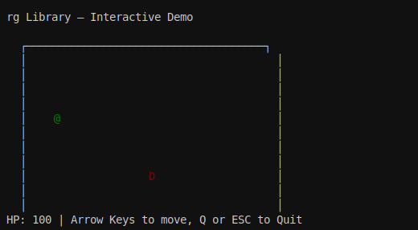

# retroglyph

[](https://github.com/crates-lurey-io/retroglyph/actions/workflows/ci.yml)
[](https://codecov.io/gh/crates-lurey-io/retroglyph)
[](https://crates-lurey-io.github.io/retroglyph/)
[](https://bencher.dev/perf/retroglyph)

A 2D pseudographic terminal library for Rust.



`retroglyph` provides a styled character grid, double-buffered rendering, and pluggable backends.

You drive the game loop; `retroglyph` handles drawing efficiently and feeding you input events.

## Features

<details open>
<summary><strong>Grid API</strong> — place styled characters on a multi-layer grid with full color support</summary>

Up to 256 layers. Each cell carries a glyph, foreground/background color, text modifiers (bold,
italic, underline, blink, reverse, dim, hidden, strikethrough), and sub-cell pixel offsets. Layer 0
is always allocated; layers 1+ are allocated on first write — single-layer games pay zero overhead.

Colors cover the full spectrum: the terminal's default foreground/background, the 16 standard ANSI
colors, the 256-color palette, and 24-bit RGB.

</details>

<details>
<summary><strong>Double buffering</strong> — diff-based presentation sends only changed cells</summary>

`Terminal::present()` compares the current frame against the previous one and forwards only the
changed cells to the backend. Pixel-based backends (software renderer) request full frames because
sub-cell offsets can leave orphaned pixels from the previous frame.

</details>

<details>
<summary><strong>Stateful drawing API</strong> — chainable builder for everyday rendering</summary>

Set the active style with `fg()`, `bg()`, `modifier()`, then place characters with `put()`. Print
strings with `print()` (handles newlines and wide characters), render styled spans with
`print_styled()`, or lay out text in a bounded rectangle with `print_box()`. Clear the active layer,
all layers, or a rectangular region. Switch layers with `layer(id)`. Or bypass the builder and
access the grid directly via `grid_mut()`.

</details>

<details>
<summary><strong>Text layout and word wrapping</strong> — styled spans with configurable alignment</summary>

`Span` and `Line` provide styled text primitives. `TextLayout` is a builder that word-wraps a `Line`
to a bounded rectangle, then positions it with independent horizontal and vertical alignment
(left/center/right, top/middle/bottom). Measure the result before rendering with
`TextLayout::measure()`.

</details>

<details>
<summary><strong>Game loop</strong> — implement <code>App</code> once, run on every backend</summary>

Implement the `App` trait (the update-side dual of `Backend`) and run it with a single
feature-selected entry point. Terminal backends use the generic `run_blocking` driver; the
software/winit backend uses its inverted driver; both share the same `App`, `Frame`, and `Flow`
types. `FrameClock` is a pure fixed-timestep accumulator (fed elapsed `dt`, so it is
`no_std`-clean). The low-level `poll`/`present` API remains for turn-based games and headless tests.

</details>

<details>
<summary><strong>Scrolling camera and map loading</strong> — worlds larger than the screen</summary>

`Camera` is a viewport onto a larger world: it converts between world and screen coordinates, clamps
to the map edges while following a target, and iterates the visible cells as `(world, screen)`
pairs. `Grid::from_charmap` builds a styled grid from an ASCII map or level string, one tile per
character. Combined with multi-layer compositing, this drives scrolling roguelikes (see the
`scrolling_roguelike` example).

</details>

<details>
<summary><strong>Extended grapheme cluster support</strong> — combining marks, emoji, and CJK wide chars</summary>

With the `egc` feature (enabled by default), the library handles full Unicode grapheme clusters:
combining marks, ZWJ emoji sequences, and multi-codepoint characters. CJK characters and emoji
automatically occupy two grid columns with a transparent spacer in the adjacent cell.
Multi-codepoint graphemes are capped at 8 codepoints to prevent combining-mark bombs.

</details>

<details>
<summary><strong>Pluggable backends</strong> — swap rendering targets without touching game logic</summary>

The `Backend` trait has a small surface: draw cells, flush, poll events, resize, cursor control.

- **Headless** — in-memory with no I/O. The workhorse for unit and integration tests. Provides
  `format_view()` for snapshot testing with insta and `push_event()` for synthetic input.
- **Crossterm** (feature `crossterm`) — full terminal with raw mode, alternate screen, and mouse
  capture. Registers a panic hook to safely restore the terminal on crashes.
- **Software** (feature `software`) — pixel-based rendering via winit + softbuffer. Uses a 1-bit
  bitmap font (embedded VGA 8x16 with `software-default-font`), with sub-cell pixel offsets,
  multi-layer compositing, configurable scale factor, and a headless mode for pixel-level testing.
- **Sprite tilesets** (feature `software-tilesets`) — PNG sprite sheets mapped to a codepage (CP437,
  Unicode range, or custom), rendered with RGBA alpha blending over bitmap font glyphs.

</details>

<details>
<summary><strong>Input handling</strong> — keyboard, mouse, resize, and close events</summary>

`Terminal::poll(timeout)` returns `Option<Event>` with support for keyboard (all standard keys +
modifier flags), mouse (buttons, movement, scroll), window resize, and close events. `has_input()`
checks for events without blocking. Resize events are automatically applied to the grid before the
event reaches your code.

</details>

<details>
<summary><strong><code>no_std</code> compatible</strong> — core crate compiles without <code>std</code></summary>

Disable the `std` feature (requires an allocator). Useful for embedded or kernel-space roguelikes.

</details>

## Quick start

The library is split into a `no_std` core plus per-backend crates. For a terminal app you need the
core and the crossterm backend:

```toml
[dependencies]
retroglyph-core = "0.2"
retroglyph-crossterm = "0.2"
```

```rust,no_run
use retroglyph_core::{Terminal, Color, event::{Event, KeyCode}};
use retroglyph_crossterm::Crossterm;

fn main() -> std::io::Result<()> {
    let mut term = Terminal::new(Crossterm::new()?);
    loop {
        term.fg(Color::GREEN);
        term.put(5, 5, '@');
        term.present()?;

        if let Some(Event::Key(k)) = term.poll(std::time::Duration::from_secs(1)) {
            if k.code == KeyCode::Char('q') {
                break;
            }
        }
    }
    Ok(())
}
```

Run the interactive demo:

```sh
cargo run --example dungeon_room --features crossterm
```
